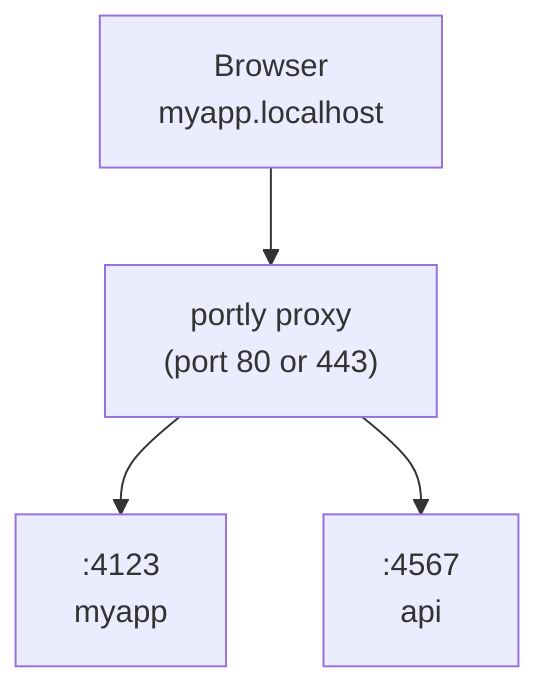

# portly

Replace port numbers with stable, named .localhost URLs for local development. For humans and agents.

```diff
- "dev": "next dev"                  # http://localhost:3000
+ "dev": "portly run next dev"     # https://myapp.localhost
```

## Install

**Global (recommended):**

```bash
npm install -g portly
```

**Or as a project dev dependency:**

```bash
npm install -D portly
```

> portly is pre-1.0. When installed per-project, different contributors may run different versions. The state directory format may change between releases, which can require re-running `portly trust`.

## Run your app

```bash
portly myapp next dev
# -> https://myapp.localhost
```

HTTPS with HTTP/2 is enabled by default. On first run, portly generates a local CA, trusts it, and binds port 443 (auto-elevates with sudo on macOS/Linux). Use `--no-tls` for plain HTTP.

The proxy auto-starts when you run an app. A random port (4000-4999) is assigned via the `PORT` environment variable. Most frameworks (Next.js, Express, Nuxt, etc.) respect this automatically. For frameworks that ignore `PORT` (Vite, VitePlus, Astro, React Router, Angular, Expo, React Native), portly auto-injects the right `--port` flag and, when needed, a matching `--host` flag.

When auto-starting, portly reuses the configuration (port, TLS, TLD) from the most recent proxy run, so a restart or reboot does not silently revert to defaults. Explicit env vars (`PORTLY_PORT`, `PORTLY_HTTPS`, etc.) always take priority.

In non-interactive environments (no TTY, or `CI=1`), portly exits with a descriptive error instead of prompting, so task runners like turborepo and CI scripts fail early with a clear message.

## Configuration

Bare `portly` works out of the box. It runs the `"dev"` script from `package.json` through the proxy, inferring the app name from the package name, git root, or directory:

```bash
portly        # -> runs "dev" script, https://<project>.localhost
```

Use an optional `portly.json` to override defaults:

```json
{ "name": "myapp" }
```

```bash
portly        # -> runs "dev" script, https://myapp.localhost
```

The script defaults to `"dev"`. The name is inferred from `package.json` if not set in config.

### Monorepo

One `portly.json` at the repo root covers all workspace packages. Portly discovers packages from `pnpm-workspace.yaml`, or the `"workspaces"` field in `package.json` (npm, yarn, bun):

```json
{
  "apps": {
    "apps/web": { "name": "myapp" },
    "apps/api": { "name": "api.myapp" }
  }
}
```

```bash
portly        # from repo root: starts all workspace packages with a "dev" script
cd apps/web && portly   # start just one package
```

The `apps` map is optional and only needed for name overrides. Packages not listed still auto-discover with names inferred from their `package.json`.

Without an `apps` map, hostnames follow the `<package>.<project>.localhost` convention. The project name comes from the most common npm scope across workspace packages (e.g. `@myorg/web` and `@myorg/api` produce `myorg`), falling back to the workspace root directory name. If a package's short name matches the project name, it gets the bare `<project>.localhost` without duplication.

### Config fields

| Field     | Type    | Default  | Description                                               |
| --------- | ------- | -------- | --------------------------------------------------------- |
| `name`    | string  | inferred | Base app name. Worktree prefix still applies.             |
| `script`  | string  | `"dev"`  | Name of a `package.json` script to run.                   |
| `appPort` | number  | auto     | Fixed port for the child process.                         |
| `proxy`   | boolean | auto     | Whether to route through the proxy. Auto-detected.        |
| `apps`    | object  |          | Overrides for workspace packages, keyed by relative path. |
| `turbo`   | boolean | `true`   | Set `false` to use direct spawning instead of turborepo.  |

### package.json "portly" key

Instead of a separate `portly.json`, you can add a `"portly"` key to your `package.json`. A string value is shorthand for setting the name:

```json
{
  "name": "@myorg/web",
  "portly": "myapp"
}
```

An object supports all per-app fields (`name`, `script`, `appPort`, `proxy`):

```json
{
  "name": "@myorg/web",
  "portly": { "name": "myapp", "script": "dev:app" }
}
```

The `package.json` `"portly"` key takes precedence over `portly.json` app entries but is overridden by CLI flags.

### --script flag

Override the default script for a single invocation:

```bash
portly --script start       # run "start" instead of "dev"
portly --script test        # run "test" instead of "dev"
```

### Turborepo

To use portly with turborepo, put `portly` as the `dev` script and the real command in a separate script:

```json
{
  "scripts": {
    "dev": "portly",
    "dev:app": "next dev"
  },
  "portly": { "name": "myapp", "script": "dev:app" }
}
```

Turbo runs each package's `dev` script, which invokes portly. Portly reads the config, detects the package manager, and runs `pnpm run dev:app` (or yarn/bun/npm) through the proxy. No changes to `turbo.json` are needed.

`pnpm dev` at the root works through turbo as usual. People without portly can run `pnpm run dev:app` directly.

## Use in package.json

You can still use portly in `package.json` scripts:

```json
{
  "scripts": {
    "dev": "portly run next dev"
  }
}
```

With a `portly.json`, you can simplify to:

```json
{
  "scripts": {
    "dev": "next dev"
  }
}
```

Then run `portly` or `portly run` to go through the proxy.

## Subdomains

Organize services with subdomains:

```bash
portly api.myapp pnpm start
# -> https://api.myapp.localhost

portly docs.myapp next dev
# -> https://docs.myapp.localhost
```

By default, only explicitly registered subdomains are routed (strict mode). Use `--wildcard` when starting the proxy to allow any subdomain of a registered route to fall back to that app (e.g. `tenant1.myapp.localhost` routes to the `myapp` app without extra registration).

## Git Worktrees

`portly run` automatically detects git worktrees. In a linked worktree, the branch name is prepended as a subdomain so each worktree gets its own URL without any config changes:

```bash
# Main worktree (no prefix)
portly run next dev   # -> https://myapp.localhost

# Linked worktree on branch "fix-ui"
portly run next dev   # -> https://fix-ui.myapp.localhost
```

Use `--name` to override the inferred base name while keeping the worktree prefix:

```bash
portly run --name myapp next dev   # -> https://fix-ui.myapp.localhost
```

Put `portly run` in your `package.json` once and it works everywhere. The main checkout uses the plain name, each worktree gets a unique subdomain. No collisions, no `--force`.

## Custom TLD

By default, portly uses `.localhost` which auto-resolves to `127.0.0.1` in most browsers. If you prefer a different TLD (e.g. `.test`), use `--tld`:

```bash
portly proxy start --tld test
portly myapp next dev
# -> https://myapp.test
```

The proxy auto-syncs `/etc/hosts` for route hostnames (including `.test`), so those domains resolve on your machine.

Recommended: `.test` (IANA-reserved, no collision risk). Avoid `.local` (conflicts with mDNS/Bonjour) and `.dev` (Google-owned, forces HTTPS via HSTS).

## How it works



1. **Start the proxy**: auto-starts when you run an app, or start explicitly with `portly proxy start`
2. **Run apps**: `portly <name> <command>` assigns a free port and registers with the proxy
3. **Access via URL**: `https://<name>.localhost` routes through the proxy to your app

## HTTP/2 + HTTPS

HTTPS with HTTP/2 is enabled by default. Browsers limit HTTP/1.1 to 6 connections per host, which bottlenecks dev servers that serve many unbundled files (Vite, Nuxt, etc.). HTTP/2 multiplexes all requests over a single connection.

On first run, portly generates a local CA and adds it to your system trust store. No browser warnings. No manual setup.

```bash
# Use your own certs (e.g., from mkcert)
portly proxy start --cert ./cert.pem --key ./key.pem

# Disable HTTPS (plain HTTP on port 80)
portly proxy start --no-tls

# If you skipped the trust prompt on first run, trust the CA later
portly trust
```

On Linux, `portly trust` supports Debian/Ubuntu, Arch, Fedora/RHEL/CentOS, and openSUSE (via `update-ca-certificates` or `update-ca-trust`). On Windows, it uses `certutil` to add the CA to the system trust store.

## Start at OS startup

Install the proxy as an OS startup service so clean HTTPS URLs are available after reboot without starting the proxy from a terminal:

```bash
portly service install
portly service install --lan
portly service install --wildcard
PORTLY_STATE_DIR=~/.portly-lan PORTLY_LAN=1 portly service install
portly service status
portly service uninstall
```

The service uses portly defaults unless install options or `PORTLY_*` environment variables are provided: HTTPS on port 443 with `.localhost` names. `service install` accepts the proxy options you would use with `proxy start`, including `--port`, `--no-tls`, `--lan`, `--ip`, `--tld`, `--wildcard`, `--cert`, and `--key`. Use `--state-dir <path>` or `PORTLY_STATE_DIR=<path>` to choose where service state and logs are written.

The chosen service configuration is written into launchd, systemd, or Task Scheduler and reused after reboot. `portly service status` reports the installed port, HTTPS mode, TLD, LAN mode, wildcard mode, and state directory. macOS and Linux install a root-owned service so port 443 can bind at boot. Windows installs a Task Scheduler startup task that runs as SYSTEM. Installation and removal may require administrator privileges. `portly clean` automatically removes the service.

## LAN mode

```bash
portly proxy start --lan
portly proxy start --lan --https
portly proxy start --lan --ip 192.168.1.42
```

`--lan` switches the proxy to mDNS discovery: services are advertised as `<name>.local` and reachable from any device on the same network. Portly auto-detects your LAN IP and follows Wi-Fi/IP changes automatically, but you can pin another address with `--ip <address>` or by exporting `PORTLY_LAN_IP`. Set `PORTLY_LAN=1` in your shell (0/1 boolean) to make LAN mode the default whenever the proxy starts.

Portly remembers LAN mode via `proxy.lan`, so if you stop a LAN proxy and start it again, it stays in LAN mode. All proxy settings (port, TLS, TLD, LAN) are persisted and reused on auto-start unless overridden by explicit flags or env vars. Use `PORTLY_LAN=0` for one start to switch back to `.localhost` mode. If a proxy is already running with different explicit LAN/TLS/TLD settings, portly warns and asks you to stop it first.

LAN mode depends on the system mDNS tools that portly already spawns: macOS ships with `dns-sd`, while Linux uses `avahi-publish-address` from `avahi-utils` (install via `sudo apt install avahi-utils` or your distro’s equivalent). If the command is missing or your network isn’t reachable, `portly proxy start --lan` prints the relevant error and exits.

### Framework notes

- **Next.js**: add your `.local` hostnames to `allowedDevOrigins`:

  ```js
  // next.config.js
  module.exports = {
    allowedDevOrigins: ["myapp.local", "*.myapp.local"],
  };
  ```

- **Expo / React Native**: portly always injects `--port`. React Native also gets `--host 127.0.0.1`. Expo gets `--host localhost` outside LAN mode, but in LAN mode portly leaves Metro on its default LAN host behavior instead of forcing `--host` or `HOST`.

## Tailscale sharing

Share your dev server with teammates on your [Tailscale](https://tailscale.com) network:

```bash
portly myapp --tailscale next dev
# -> https://myapp.localhost           (local)
# -> https://devbox.yourteam.ts.net    (tailnet)
```

Each `--tailscale` app is root-mounted on its own Tailscale HTTPS port, so no framework `basePath` configuration is needed. The first app gets port 443, subsequent apps get 8443, 8444, etc.

```bash
portly myapp --tailscale next dev     # -> https://devbox.ts.net
portly api --tailscale pnpm start     # -> https://devbox.ts.net:8443
```

Use `--funnel` to expose your dev server to the public internet via [Tailscale Funnel](https://tailscale.com/kb/1223/funnel/):

```bash
portly myapp --funnel next dev
# -> https://devbox.yourteam.ts.net    (public)
```

Tailscale HTTPS certificates must be enabled before `--tailscale` or `--funnel` can register HTTPS URLs. Funnel must also be enabled for the tailnet and node before `--funnel` can register the public URL. If either setting is missing, portly exits before starting the child process.

Set `PORTLY_TAILSCALE=1` in your shell profile or `.env` to share every app by default. `portly list` shows both local and tailnet URLs. Tailscale serve registrations are cleaned up automatically when the app exits.

Requires the Tailscale CLI to be installed and connected (`tailscale up`), with Tailscale HTTPS certificates enabled.

## ngrok sharing

Expose your dev server to the public internet with [ngrok](https://ngrok.com):

```bash
portly myapp --ngrok next dev
# -> https://myapp.localhost           (local)
# -> https://abc123.ngrok.app          (public)
```

Set `PORTLY_NGROK=1` in your shell profile or `.env` to enable ngrok by default when portly runs an app. `portly list` shows both local and ngrok URLs. The ngrok tunnel is cleaned up automatically when the app exits.

Requires the ngrok CLI to be installed and authenticated. If ngrok reports an authentication error, run `ngrok config add-authtoken <token>` and try again.

## Cloudflare sharing

Expose your dev server to the public internet via a [Cloudflare quick tunnel](https://developers.cloudflare.com/cloudflare-one/connections/connect-networks/do-more-with-tunnels/trycloudflare/) — no account, login, or domain required:

```bash
portly myapp --cloudflare next dev
# -> https://myapp.localhost                    (local)
# -> https://random-words.trycloudflare.com     (public)
```

Set `PORTLY_CLOUDFLARE=1` in your shell profile or `.env` to enable it by default when portly runs an app. `portly list` shows both local and Cloudflare URLs. The tunnel is cleaned up automatically when the app exits.

Requires only the [`cloudflared`](https://developers.cloudflare.com/cloudflare-one/connections/connect-networks/downloads/) CLI to be installed. Quick tunnel URLs (`*.trycloudflare.com`) are meant for testing — they rotate between runs and may be rate-limited, so they are **not** suitable for stable webhook registration.

### Stable named tunnels (for webhooks)

For a **stable** public hostname on your own domain — the right choice for registering webhooks — add `--hostname`. This provisions a [named Cloudflare tunnel](https://developers.cloudflare.com/cloudflare-one/connections/connect-networks/get-started/create-remote-tunnel/) against your own (free) Cloudflare account, so the URL stays the same across runs and stays registered with Stripe/GitHub/etc.

Authorize a domain once (opens a browser, writes `~/.cloudflared/cert.pem`):

```bash
portly tunnel login
```

Then run any app with a hostname in that domain:

```bash
portly myapp --cloudflare --hostname hooks.example.com next dev
# -> https://myapp.localhost        (local)
# -> https://hooks.example.com      (stable, public, persists across runs)
```

`--hostname` implies `--cloudflare`, so `portly myapp --hostname hooks.example.com next dev` is enough. On each run portly reuses the existing tunnel (`portly-<hostname>`) and DNS record instead of recreating them, and ties only the tunnel process to the app — the hostname keeps resolving across restarts.

Set it per-repo in `portly.json` so you never type it:

```json
{ "name": "myapp", "cloudflare": { "hostname": "hooks.example.com" } }
```

Manage tunnels with the `tunnel` subcommand:

```bash
portly tunnel login              # Authorize a domain (one-time)
portly tunnel list               # List your Cloudflare tunnels
portly tunnel delete hooks.example.com  # Delete a portly-managed tunnel
```

Because the tunnel and DNS record persist by design, they are **not** removed when the app stops or by `portly clean` — use `portly tunnel delete` to remove them. Deleting a tunnel leaves its DNS CNAME in place; remove it from the Cloudflare dashboard if you no longer want the hostname to resolve.

## Commands

```bash
portly                        # Run dev script through proxy
portly                        # From monorepo root: run all workspace packages
portly run [--name <name>] [cmd] [args...]  # Infer name, run through proxy
portly <name> <cmd> [args...]  # Run app at https://<name>.localhost
portly alias <name> <port>     # Register a static route (e.g. for Docker)
portly alias <name> <port> --force  # Overwrite an existing route
portly alias --remove <name>   # Remove a static route
portly list                    # Show active routes
portly trust                   # Add local CA to system trust store
portly clean                   # Remove state, CA trust entry, and hosts block
portly prune                   # Kill orphaned dev servers from crashed sessions
portly hosts sync              # Add routes to /etc/hosts (fixes Safari)
portly hosts clean             # Remove portly entries from /etc/hosts
portly tunnel login            # Authorize a Cloudflare domain (named tunnels)
portly tunnel list             # List your Cloudflare tunnels
portly tunnel delete <host>    # Delete a portly-managed named tunnel

# Disable portly (run command directly)
PORTLY=0 pnpm dev              # Bypasses proxy, uses default port

# Proxy control
portly proxy start             # Start the HTTPS proxy (port 443, daemon)
portly proxy start --no-tls    # Start without HTTPS (port 80)
portly proxy start --lan       # Start in LAN mode (mDNS .local for devices)
portly proxy start -p 1355     # Start on a custom port (no sudo)
portly proxy start --foreground  # Start in foreground (for debugging)
portly proxy start --wildcard  # Allow unregistered subdomains to fall back to parent
portly proxy stop              # Stop the proxy

# OS startup service
portly service install         # Start HTTPS proxy when the OS starts
portly service install --lan   # Start service in LAN mode
portly service install --wildcard  # Persist wildcard routing in the service
portly service status          # Show service and proxy status
portly service uninstall       # Remove the startup service
```

### Options

```
-p, --port <number>              Port for the proxy (default: 443, or 80 with --no-tls)
--no-tls                         Disable HTTPS (use plain HTTP on port 80)
--https                          Enable HTTPS (default, accepted for compatibility)
--lan                            Enable LAN mode (mDNS .local for real devices)
--ip <address>                   Pin a specific LAN IP (disables auto-follow; use with --lan)
--cert <path>                    Use a custom TLS certificate
--key <path>                     Use a custom TLS private key
--foreground                     Run proxy in foreground instead of daemon
--tld <tld>                      Use a custom TLD instead of .localhost (e.g. test)
--wildcard                       Allow unregistered subdomains to fall back to parent route
--state-dir <path>               Use a custom state directory with service install
--script <name>                  Run a specific package.json script (default: dev)
--app-port <number>              Use a fixed port for the app (skip auto-assignment)
--tailscale                      Share the app on your Tailscale network (tailnet)
--funnel                         Share the app publicly via Tailscale Funnel
--ngrok                          Share the app publicly via ngrok
--cloudflare                     Share the app publicly via a Cloudflare quick tunnel
--hostname <fqdn>                Stable public hostname for a named Cloudflare tunnel (implies --cloudflare)
--force                          Kill the existing process and take over its route
--name <name>                    Use <name> as the app name
```

### Environment variables

```
# Configuration
PORTLY_PORT=<number>           Override the default proxy port
PORTLY_APP_PORT=<number>       Use a fixed port for the app (same as --app-port)
PORTLY_HTTPS=0                 Disable HTTPS (same as --no-tls)
PORTLY_LAN=1                   Enable LAN mode when set to 1 (auto-detects LAN IP)
PORTLY_LAN_IP=<address>        Pin a specific LAN IP for LAN mode
PORTLY_TLD=<tld>               Use a custom TLD (e.g. test; default: localhost)
PORTLY_WILDCARD=1              Allow unregistered subdomains to fall back to parent route
PORTLY_SYNC_HOSTS=0            Disable auto-sync of /etc/hosts (on by default)
PORTLY_TAILSCALE=1             Share apps on your Tailscale network (same as --tailscale)
PORTLY_FUNNEL=1                Share apps publicly via Tailscale Funnel (same as --funnel)
PORTLY_NGROK=1                 Share apps publicly via ngrok (same as --ngrok)
PORTLY_CLOUDFLARE=1            Share apps publicly via Cloudflare quick tunnel (same as --cloudflare)
PORTLY_CLOUDFLARE_HOSTNAME     Stable hostname for a named Cloudflare tunnel (same as --hostname)
PORTLY_STATE_DIR=<path>        Override the state directory

# Injected into child processes
PORT                             Ephemeral port the child should listen on
HOST                             Usually 127.0.0.1 (omitted for Expo in LAN mode)
PORTLY_URL                     Public URL (e.g. https://myapp.localhost)
PORTLY_TAILSCALE_URL           Tailscale URL of the app (when --tailscale is active)
PORTLY_NGROK_URL               ngrok URL of the app (when --ngrok is active)
PORTLY_CLOUDFLARE_URL          Cloudflare tunnel URL of the app (when --cloudflare is active)
NODE_EXTRA_CA_CERTS              Path to the portly CA (when HTTPS is active)
```

> **Reserved names:** `run`, `get`, `alias`, `hosts`, `list`, `trust`, `clean`, `prune`, `proxy`, `service`, and `tunnel` are subcommands and cannot be used as app names directly. Use `portly run <cmd>` to infer the name from your project, or `portly --name <name> <cmd>` to force any name including reserved ones.

## Uninstall / reset

To remove portly data from your machine (proxy state under `~/.portly` and the system state directory, the local CA from the OS trust store when portly installed it, and the portly block in `/etc/hosts`):

```bash
portly clean
```

macOS/Linux may prompt for `sudo`. Custom certificate paths passed with `--cert` and `--key` are not deleted.

## Safari / DNS

`.localhost` subdomains auto-resolve to `127.0.0.1` in Chrome, Firefox, and Edge. Safari relies on the system DNS resolver, which may not handle `.localhost` subdomains on all configurations.

If Safari can't find your `.localhost` URL:

```bash
portly hosts sync    # Add current routes to /etc/hosts
portly hosts clean   # Clean up later
```

Auto-syncs `/etc/hosts` for route hostnames by default (`.localhost`, custom TLDs, LAN `.local`). Set `PORTLY_SYNC_HOSTS=0` to disable.

## Proxying Between Portly Apps

If your frontend dev server (e.g. Vite, webpack) proxies API requests to another portly app, make sure the proxy rewrites the `Host` header. Without this, portly routes the request back to the frontend in an infinite loop.

**Vite** (`vite.config.ts`):

```ts
server: {
  proxy: {
    "/api": {
      target: "https://api.myapp.localhost",
      changeOrigin: true,
      ws: true,
    },
  },
}
```

**webpack-dev-server** (`webpack.config.js`):

```js
devServer: {
  proxy: [{
    context: ["/api"],
    target: "https://api.myapp.localhost",
    changeOrigin: true,
  }],
}
```

Portly automatically sets `NODE_EXTRA_CA_CERTS` in child processes so Node.js trusts the portly CA. If you run a separate Node.js process outside portly, point it at the CA manually: `NODE_EXTRA_CA_CERTS=~/.portly/ca.pem`. Alternatively, use `--no-tls` for plain HTTP.

Portly detects this misconfiguration and responds with `508 Loop Detected` along with a message pointing to this fix.

## Development

This repo is a pnpm workspace monorepo using [Turborepo](https://turbo.build). The publishable package lives in `packages/portly/`.

Use Node.js 24+ and pnpm 11 for repository development. The `.node-version` file pins the Node major for version managers.

```bash
pnpm install          # Install all dependencies
pnpm build            # Build all packages
pnpm test             # Run tests
pnpm test:coverage    # Run tests with coverage
pnpm lint             # Lint all packages
pnpm type-check       # Type-check all packages
pnpm format           # Format all files with Prettier
```

## Requirements

- Node.js 24+
- macOS, Linux, or Windows
- Tailscale CLI (optional, for `--tailscale` and `--funnel`)
- ngrok CLI (optional, for `--ngrok`)
- cloudflared CLI (optional, for `--cloudflare`)
